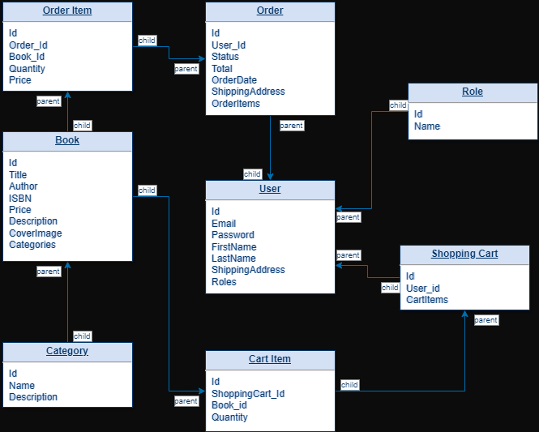

<p>
    
</p>

# Online Book Store

[](#)

<a href="https://github.com/Vadym-Ozi/Online-book-store/graphs/contributors" target="_blank">

</a>

⭐ Star us on GitHub — it motivates us a lot!

Welcome to Online Book Store — your go-to destination for a vast 
collection of books across all genres. Whether you're an avid reader 
or just starting your literary journey, we offer a diverse range 
of books to suit every taste and interest. Enjoy a seamless shopping 
experience with our user-friendly interface and find your next great 
read today!

<p align="center">
    
</p>

<div style="text-align: right; font-size: 34px; font-weight: bold;">
"The Seed of Every Idea"
</div>


<p align="center">
  <a href="#bulb-what-is-this-API">About</a> &nbsp;&bull;&nbsp;
  <a href="#bulb-requirements">Requirements</a> &nbsp;&bull;&nbsp;
  <a href="#bulb-installation-and-build">Installation and build</a> &nbsp;&bull;&nbsp;
  <a href="#bulb-model-interaction">Model Interaction</a> &nbsp;&bull;&nbsp;
  <a href="#bulb-usage-examples-examples-of-how-to-use-the-project-or-its-api">Usage Examples</a> &nbsp;&bull;&nbsp;
  <a href="#bulb-contributors">Contributors</a> &nbsp;&bull;&nbsp;
  <a href="#bulb-contacts-and-authors">Contacts and Authors</a>
</p>

## :bulb: What is this API?

&nbsp;&nbsp;&nbsp;&nbsp;&nbsp;The **Online Book Store API** provides a set of RESTful endpoints for managing an online bookstore.
It allows users to search for books, view detailed information about them, and perform CRUD 
(Create, Read, Update, Delete) operations on categories, books, and user accounts. 
The API is designed to be secure, scalable, and easy to integrate with front-end applications, 
enabling seamless e-commerce functionality for bookstores.


## :bulb: Requirements

### 1. Operating System
- Windows 10/11, macOS, or Linux (Ubuntu, Debian)

### 2. Software Dependencies
- **Java Development Kit (JDK) 17 or higher**
  - Make sure the `JAVA_HOME` environment variable is set correctly.
- **Maven 3.6.3 or higher**
  - Used for building the project and managing dependencies.
- **Docker 20.10 or higher**
  - Required for containerization and running the application in a Docker environment.
- **Docker Compose 1.29 or higher**
  - Needed for orchestrating multi-container Docker applications.

### 3. Database
- **MySQL 8.0 or higher**
  - The project uses MySQL as the database. Ensure that MySQL is installed and running, or use the Docker setup provided.

### 4. Additional Tools
- **Git**
  - For cloning the repository and version control.

### 5. Browser
- **Modern Web Browser**
  - Chrome, Firefox, Edge, or Safari for accessing Swagger UI and testing the API.


## :bulb: Installation and build

To install this project, you will need to have on your machine :


### Explanation:

- **1. Clone the repository**: Instructions for cloning the project from GitHub.
- **2. Install dependencies**: Example of using Maven to install all project dependencies.
- **3. Configuration**: Instructions for creating and setting up the `.env` file for environment variables such as database configuration.
- **4. Run the project with Docker**: Commands to build and run Docker containers.
- **5. Access the application**: URL to access your application and Swagger UI.
- **6. Stop the application**: Instructions for stopping and removing Docker containers.

### 1. Clone the repository
  Clone the repository to your local machine using Git:

```bash
git clone https://github.com/Vadym-Ozi/Online-Book-store.git
```
### 2. Install dependencies
  Install the required dependencies using Maven:
```bash
mvn clean install
```
### 3. Configuration
  Create a .env file in the root of the project and configure the necessary 
environment variables, such as the database configuration:
```
MYSQLDB_USER=root
MYSQLDB_PASSWORD=yourpassword
MYSQLDB_DATABASE=yourdatabase
MYSQLDB_LOCAL_PORT=3307
MYSQLDB_DOCKER_PORT=3306

SPRING_LOCAL_PORT=8081
SPRING_DOCKER_PORT=8080
```
### 4. Run the project with Docker
  Run the project using Docker Compose:
```bash
docker-compose up --build
```
### 5. Access the application
  Once the project is running, it will be accessible at:
```bash
http://localhost:8080/api
```
  Swagger UI for API testing is available at:
```bash
http://localhost:8080/api/swagger-ui/
```
### 6. Stop the application
   To stop and remove the running Docker containers, use the command:
```bash
docker-compose down
```


## :bulb: Model Interaction

<p align="center">
    
</p>


## :bulb: Usage Examples: Examples of how to use the project or its API
### 
### Explanation
- **1. Creating a new book:** Shows how to add a new book to the database by making a POST request.
- **2. Retrieving all books with pagination:** Demonstrates how to get a list of books with pagination.
- **3. Updating a book:** Shows how to update existing book details using a PUT request.
- **4. Deleting a book:** Explains how to remove a book by its ID

1. Create new book request:
```
POST /books
Content-Type: application/json

{
    "title": "Test Book",
    "author": "Test Author",
    "price": 2120.0,
    "isbn": "1122334455668",
    "description": "Sample book description.",
    "coverImage": "http://example.com/coverImg.jpg",
    "categoryIds": [3]
}
```
  Response:
```
{
  "id": 2,
  "title": "Book Title 2",
  "author": "Author 2",
  "price": 29.99,
  "isbn": "ISBN000000002",
  "description": "Description for Book 2",
  "coverImage": "cover2.jpg",
  "categoryIds": []
}
```
2. Get all books with pagination
```
GET /books?page=0&size=5
```
  Response:
```
{
"content": [
{
  "id": 1,
  "title": "Book Title 1",
  "author": "Author 1",
  "price": 29.99,
  "isbn": "ISBN000000001",
  "description": "Description for Book 1",
  "coverImage": "cover1.jpg",
  "categoryIds": [1]
},
{
  "id": 2,
  "title": "Book Title 2",
  "author": "Author 2",
  "price": 29.99,
  "isbn": "ISBN000000002",
  "description": "Description for Book 2",
  "coverImage": "cover2.jpg",
  "categoryIds": [2]
}
],
"totalElements": 2,
"totalPages": 1,
"size": 5,
"number": 0
}
```
3. Updating book information
```
PUT /books/1
Content-Type: application/json

{
"title": "Updated Book",
"author": "Updated Author",
"price": 29.99,
"isbn": "1122334450000",
"description": "Updated book description.",
"coverImage": "http://example.com/newCoverImg.jpg",
"categoryIds": [3]
}
```
Response:
```
{
"id": 1,
"title": "Updated Book",
"author": "Updated Author",
"price": 29.99,
"isbn": "1122334450000",
"description": "Updated book description.",
"coverImage": "http://example.com/newCoverImg.jpg",
"categoryIds": [3]
}
```
4. Deleting book
```
DELETE /books/1
```
Response:
> As a response for this action u will receive status code 200.


## :bulb: Contributors

There is no contributor yet. Want to be the first ?

If you want to contribute to this project, please read the [**contribution guide**](https://github.com/Vadym-Ozi/Online-Book-store/blob/master/docs/CONTRIBUTING.md).


## :bulb: Contacts and Authors

### Project Authors
- **Vadym Pantielieienko** - [GitHub](https://github.com/Vadym-Ozi) | [LinkedIn](https://linkedin.com/in/vadympantielieienko)

### Contact Information
If you have any questions, suggestions, or feedback, feel free to reach out:

- **Email**: VadymPantielieienko@gmail.com

